# Macro Tracker

A modern, professional macro nutrition tracking application built with React and Firebase.


## Features

- **User Authentication** - Secure email/password login and registration via Firebase Auth
- **Meal Tracking** - Log meals with name, calories, protein, carbs, and fat
- **User Profile** - Track weight, height, and activity level
- **Daily Totals** - Automatic calculation of daily macro totals
- **Modern UI** - Professional design with gradient backgrounds, glassmorphic cards, and responsive layout
- **Real-time Sync** - Meals stored in Firestore for persistent data across sessions

## Tech Stack

| Layer | Technology |
|-------|------------|
| Frontend | React 19, CSS3 |
| Authentication | Firebase Auth |
| Database | Cloud Firestore |
| Styling | Custom CSS with Inter font |

## Architecture

```mermaid
graph TB
    subgraph User["👤 USER"]
        U1[📧 Email/Password]
        U2[📝 Meal Input]
        U3[⚖️ Profile Data]
    end

    subgraph Frontend["⚛️ FRONTEND<br/>React Dashboard"]
        Login[Login/Register<br/>Form]
        MealForm[Meal Form<br/>Name + Macros]
        UserInfo[User Profile<br/>Weight/Height/Activity]
        Display[Live Dashboard<br/>+ Daily Totals]
    end

    subgraph Firebase["🔥 FIREBASE SERVICES"]
        Auth[Firebase Auth<br/>Email/Password]
        Firestore[(Firestore<br/>Database)]
    end

    subgraph State["📊 APP STATE"]
        Meals[Meals Array]
        Totals[Macro Totals<br/>Calories/Protein/Carbs/Fat]
        UserState[User Session]
    end

    %% User to Frontend
    U1 --> Login
    U2 --> MealForm
    U3 --> UserInfo

    %% Frontend to Firebase
    Login -->|signIn/<br/>createUser| Auth
    Auth -->|User Credential| Login
    MealForm -->|addMealToFirestore| Firestore

    %% Firebase to State
    Auth -->|onAuthStateChanged| UserState
    Firestore -->|Read meals| Meals

    %% State calculations
    Meals -->|Calculate sums| Totals

    %% State to Display
    UserState --> Display
    Meals --> Display
    Totals --> Display

    %% Styling
    classDef userStyle fill:#667eea,stroke:#333,stroke-width:2px,color:#fff
    classDef frontendStyle fill:#764ba2,stroke:#333,stroke-width:2px,color:#fff
    classDef firebaseStyle fill:#FF6B00,stroke:#333,stroke-width:2px,color:#fff
    classDef stateStyle fill:#22c55e,stroke:#333,stroke-width:2px,color:#fff
    
    class U1,U2,U3 userStyle
    class Login,MealForm,UserInfo,Display frontendStyle
    class Auth,Firestore firebaseStyle
    class Meals,Totals,UserState stateStyle
```



## Project Structure

```
macro-tracker/
├── public/
│   ├── index.html
│   ├── favicon.ico
│   └── manifest.json
├── src/
│   ├── styles/
│   │   └── App.css              # Main stylesheet with design system
│   ├── UserInterfaceComponents/
│   │   ├── LogIn.js             # Authentication form
│   │   ├── mealForm.js          # Add meal form
│   │   ├── mealList.js          # Display meals list
│   │   ├── mealServices.js      # Firestore operations
│   │   └── UserInfo.js          # User profile form
│   ├── App.js                   # Main app component
│   ├── firebase.js              # Firebase configuration
│   └── index.js                 # Entry point
├── package.json
└── .env                         # Environment configuration
```

## Getting Started

### Prerequisites

- Node.js 18+ installed
- A Firebase project with Authentication and Firestore enabled

### Installation

1. Clone the repository
   ```bash
   git clone <repository-url>
   cd macro-tracker
   ```

2. Install dependencies
   ```bash
   npm install
   ```

3. Configure Firebase
   
   Update `src/firebase.js` with your Firebase project credentials:
   ```javascript
   const firebaseConfig = {
     apiKey: "YOUR_API_KEY",
     authDomain: "YOUR_PROJECT.firebaseapp.com",
     projectId: "YOUR_PROJECT_ID",
     storageBucket: "YOUR_PROJECT.appspot.com",
     messagingSenderId: "YOUR_SENDER_ID",
     appId: "YOUR_APP_ID"
   };
   ```

4. Start the development server
   ```bash
   npm start
   ```

5. Open [http://localhost:5000](http://localhost:5000) in your browser

## Design System

| Element | Style |
|---------|-------|
| Background | Purple gradient (#667eea → #764ba2) |
| Cards | White glassmorphic with blur effect |
| Calories Badge | Yellow (#fef3c7 → #fde68a) |
| Protein Badge | Blue (#dbeafe → #bfdbfe) |
| Carbs Badge | Pink (#fce7f3 → #fbcfe8) |
| Fat Badge | Purple (#e0e7ff → #c7d2fe) |
| Font | Inter (Google Fonts) |

## Scripts

| Command | Description |
|---------|-------------|
| `npm start` | Start development server |
| `npm run build` | Create production build |
| `npm test` | Run tests |

